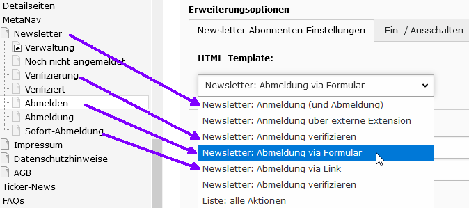

.. ==================================================
.. FOR YOUR INFORMATION
.. --------------------------------------------------
.. -*- coding: utf-8 -*- with BOM.

.. include:: ../../Includes.txt

.. _user-manual:

Benutzerhandbuch
================

Die Extension kann über TypoScript und FlexForms konfiguriert werden.
Benutzer werden eher die FlexForms benutzen. Hier ein Beispiel der FlexForm-Einstellungen:

.. figure:: ../../Images/UserManual/BackendView.png
   :width: 660px
   :alt: Backend view

   Die Backend-Ansicht (BE)

Zahlreiche Links können für die Zielseiten spezifiziert werden.

Der Abmeldelink muss per TypoScript oder via FlexForms angegeben werden und es muss eine Extra-Seite für die Abmeldung geben.
Hier eine Beispiel-Konfiguration:

   Beispiel-Konfiguration des Plugins
   
Beachte: in den Formularen sind die Felder E-Mail und DSGVO obligatorisch. Andere Felder sind optional: siehe
im Kapitel Konfiguration.