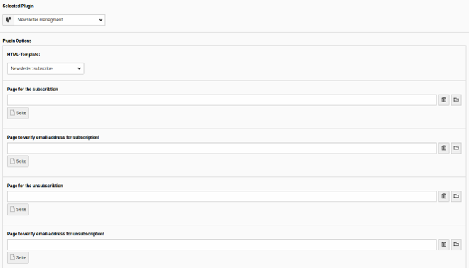

.. ==================================================
.. FOR YOUR INFORMATION
.. --------------------------------------------------
.. -*- coding: utf-8 -*- with BOM.

.. include:: ../Includes.txt

.. _user-manual:

Users Manual
============

This extension can be configured via TypoScript and via FlexForms.
Users will use the FlexForms. Here you find an screenshot of the FlexForm settings:

   Default Backend view of the plugin

Several links can be specified for entry pages and redirect pages.

Note: in the form the fields email and GDPR are always obligatory/mandatory. All other fields are optional.
Take a look at the Configuration chapter of this manual.